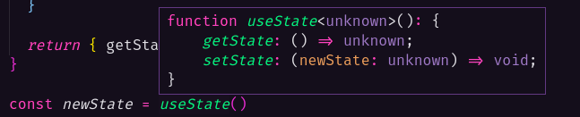
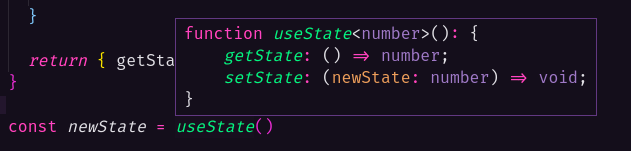

# Generics

Para reutilizar código é necessário torná-lo mais "genérico", as funções precisam receber diferentes tipos de argumentos e obter um retorno esperado.

Porém, ao trabalhar com TypeScript, que diferente do JavaScript é uma linguagem tipada e não dinâmica, temos que definir o tipo de entrada, e ai o que era para ser genérico, acaba não sendo.

O Generics fornece um pouco mais de flexibilidade para linguagems fortemente tipadas, para que possamos aceitar diferentes tipos de entradas.

No exemplo abaixo, criamos uma função que simula um estado (como no hook do React), ele tem duas funções, um Getter e um Setter que simplemente obtem ou seta um novo valor do tipo `number`:

```ts
function useState() {
  let state: number

  function getState() {
    return state
  }

  function setState(newState: number) {
    state = newState
  }

  return { getState, setState }
}

const newState = useState()

newState.setState(23)

console.log(newState.getState()) // 23
```

Agora vamos supor que precisamos utilizar essa função novamente, só que ao invés de usar número, temos que usar `string`, isso até poderia ser resolvido através do [union](../7-type-aliases-union/type-aliases-union.md), adicionando o tipo `string`:

```ts
function useState() {
  let state: number | string

  function getState() {
    return state
  }

  function setState(newState: number | string) {
    state = newState
  }

  return { getState, setState }
}

newState.setState(23)

console.log(newState.getState()) // 23

newState.setState('Hello')

console.log(newState.getState()) // Hello
```

## Criando um Generic

Porém, neste caso, não queremos que o estado seja alterado para outro tipo, após ele receber um valor inicial, ai que entra o Generics.

Para definir um Generic, crie um nome e insira ele dele dentro dos caracteres `<` e `>`, após o nome da função e antes de sua chamada, no geral é comum utilizarmos nomearmos Generics com simbolos/letras que representem algo, neste caso um state (estado):

```ts
function useState<S>() {
  ...
  function setState(newState: S) {
    state = newState
  }
  ...
}
```

Neste exemplo criamos um Generic chamado `S`, porém poderia ser qualquer outra coisa, inclusive existem alguns padrões de siglas utilizadas no TypeScript:

- `S`: State
- `T`: Type
- `K`: Key
- `V`: Value
- `E`: Element

## Flexibilidade do Generics e o Type Unknown

Ao definir um Generic como `S`, O TypeScript entende que agora a funçao trabalha com esse tipo, mas repare que ao passar o mouse sobre a chamada da função, o TypeScript definiu o tipo como `unknown` (desconhecido).



O tipo `unknown` é parecido com o `any`, porém diferente dele, o `unknown` atribui um tipo específico no momento em que a função é utilizada, caso seja passado um `number`, ele passará a aceitar apenas `number`.

```ts
newState.setState(23)

console.log(newState.getState()) // 23

newState.setState('Hello')

console.log(newState.getState()) // Error: Argument of type 'string' is not assignable to parameter of type 'number'.
```

## Extendendo o Generic

Isso resolve o problema de reatribuição de tipos, porém ainda temos outro problema, se na chamada da função setarmos o Generic como Booolean, `const newState = useState<boolean>()`, então, ela passará a aceitar apenas este tipo, só que nessa função queremos apenas `string` ou `number`.

Para limitar e definir a atribuição de tipos, podemos extender o Generic `S` com os tipos `number` e `string`:

```ts
function useState<S extends number | string>() {
  ...
}

const newState = useState<boolean>() // Error: Type 'boolean' does not satisfy the constraint 'string | number'.
```

## Definindo o tipo padrão do Generic

E caso seja necessário definir um dos tipos como default, por exemplo o `number`, podemos atribuir um valor padrão através da keyword `=` no final do Generics:

```ts
function useState<S extends number | string = number>() {
  ...
}
```

Desta forma, o uso da sintaxe de Generics na chamada da função pode ser removido, porque o TypeScript já irá considear como type `number` ao invés de `unknown`:

```ts
const newState = useState()
```



E para finalizar, o Generics não aceita somente tipos primitivos, nele também podemos colocar interfaces ou aliases, por exemplo:

```ts
type numberOrString = number | string

function useState<S extends numberOrString = number>() {
  ...
}
```

> O exemplo que vimos é similar aos hooks de estado do **React**, quando definimos algum valor no hook `useState()`, o tipo do estado não poderá ser alterado depois.
