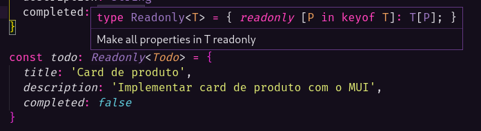
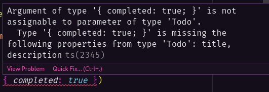
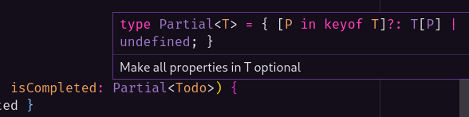

# Type Utilities

São utilitários usados para nos ajudar a trabalhar com tipos, as vezes ao criar algum tipo, seja com [interface](../10-interfaces/interfaces.md) ou seja com [type aliases](../7-type-aliases-union/type-aliases-union.md), precisamos fazer algum tipo de operação, e neste momento os Utilities podem ser úteis.

Para entender o uso do utilities vamos pegar como exemplo o código abaixo que simula um tipo para uma feature de "To-do":

```ts
type Todo = {
  title: string
  description: string
  completed: boolean
}

const todo: Todo = {
  title: 'Card de produto',
  description: 'Implementar card de produto com o MUI',
  completed: false
}
```

## Utility Readonly

Caso seja necessário atualizar a propriedade `completed` para `true`, podemos alterá-la da seguinte maneira:

```ts
todo.completed = true
```

Porém isso gera uma mutação, que pode causar efeitos colaterais na aplicação, então para manter a imutabilidade e seguir um paradigma funcional, ao invés de alterar diretamente o objeto, podemos por exemplo criar uma função que cria um novo objeto atualizado a partir do objeto original.

Não queremos que a propriedade seja alterada diretamente por atribuição, já vimos na aula de [classes](../9-classes/classes.md), que o TypeScript possui modificadores, entre eles o `readonly` que faz com que a propriedade não possa ser editada, neste caso, podemos aplicar esta mesma funcionalidade transformando o type `Todo` em um [generic](../12-generics/generics.md) e adicionando a utility `Readonly` antes dele:

```ts
const todo: Readonly<Todo> = {
  title: 'Card de produto',
  description: 'Implementar card de produto com o MUI',
  completed: false
}
```

O TypeScript irá fazer com que todas as propriedades do tipo "**T**" (_de tipo, no caso o_ `Todo`), possuam o modificador `readonly`:



## Utility Pick

Agora vamos criar a função que atualiza o status de um objeto `Todo`, ele vai receber dois argumentos, o primeiro é o objeto do tipo `Todo` e o segundo são os campos que queremos atualizar, neste caso só o `completed` mesmo, então ele vai utilizar o operador spread para atualizar o objeto com a propriedade nova:

```ts
function updatedTodo(todo: Todo, isCompleted: Todo) {
  return { ...todo, ...isCompleted }
}

const todoUpdated = updatedTodo(todo, { completed: true })
```

Só que ai temos um problema, se colocarmos o tipo do argumento `isCompleted` como `Todo`, o TypeScript irá gerar um erro, porque já definimos que todo dado que tiver este tipo deve receber as 3 propriedades obrigatóriamente: `title`, `description` e `completed`:



Poderiamos resolver isso colocando a keyword `?` nas propriedades para torná-las opcionais, mas neste caso isso não faz sentido, porque queremos que essas propriedadaes sejam obrigatórias mesmo.

Uma segunda maneira de resolver seria criando um outro tipo que receba apenas a propriedade `completed` para que seja utilizada no argumento `isCompleted`. O utilitário `Pick` é utilizado para pegar um tipo existente como base e criar um novo tipo APENAS com as propriedades necessárias:

```ts
type TodoStatus = Pick<Todo, 'completed'>

function updatedTodo(todo: Todo, isCompleted: TodoStatus) {
  return { ...todo, ...isCompleted }
}
```

## Utility Partial

Ainda há uma terceria maneira de resolver que é com utility `Partial`, esse utilitário pode ser adicionado antes de um Generic de `Todo`, indicando que o dado em questão pode conter propriedades parciais desse tipo:

```ts
function updatedTodo(todo: Todo, isCompleted: Partial<Todo>) {
  return { ...todo, ...isCompleted }
}
```

> Por debaixo do panos ele transformou todas as propriedades de `Todo` em opcionais, porém ele faz isso exclusivamente para o argumento `isCompleted`.



## Utility Omit

Agora supomos que precisamos exibir apenas os `title` e o `description` de um objeto `Todo` em alguma tela, neste caso, como temos duas propriedades para usar, podemos utilizar o utilitário `Omit`, que é similar ao `Pick`, porém ao invés de pegar uma ou mais propriedades, ele vai omitir as propriedade que não precisamos:

```ts
type TodoOverview = Omit<Todo, 'completed'> // omite a prop 'completed'

const todoOverview: TodoOverview = {
  title: 'Fechar tasks do Jira',
  description: 'Preencher todos os pontos das tasks'
}
```

> O desevolvedor deve avaliar a quantidade de propriedades que serão usadas/omitidas para identificar se é melhor utilizar o `Pick` ou o `Omit`.
