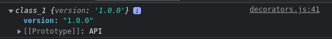

# Decorators

O Decorator é um tipo especial de declaração que adiciona funcionalidades extras à uma declaração de classe, métodos, acessadores, propriedades ou parâmetros.

Existem diversos tipos de Decorators, para criar um Decorator basta criar uma função que por padrão vai possuir argumentos default baseados no tipo de Decorator na qual está trabalhando.

## Class Decorator

O primeiro tipo de Decorator que vamos ver é o Decorator de Classe. A função Decorator desse tipo recebe um parametro `target` (pode ter qualquer outro nome) que representa o constructor da classe.

Para utilizar um Decorator basta utilizar a keyword `@` seguida do nome do Decorator, acima da classe a qual queremos implementá-lo:

```ts
function log(target) {
  console.log(target)
}

@log
class Foo {}
```

No exemplo acima será exibido no console a função/classe `Foo`, já que o parâmetro `target` representa a própria classe.

Através do design pattern "_Factory_" podemos passar parâmetros para o decorator, então basicamente vamos criar uma função que vai retornar a criação deste decorator, neste exemplo vamo criar criar um Decorator que pode receber uma String como parâmetro:

```ts
function logger(prefix: String) {
  return target => {
    console.log('logger target\n', target)
    console.log(prefix)
  }
}

@logger('A função Foo foi executada!')
class Foo {}
```

Neste outro exemplo mais complexo, o Decorator terá o objetivo de anotar a versão quando um objeto da classe API for criado, ou sejá, o objeto já receberá uma propriedade chamada `version` definida pelo argumento recebido do Decorator:

```ts
function setAPIVersion(apiVersion: String) {
  return constructor => {
    return class extends constructor {
      version = apiVersion
    }
  }
}

@setAPIVersion('1.0.0')
class API {}

console.log(new API())
```



## Property Decorator

Esse Decorator trabalha com propriedades, o caso mais comum é fazer validações de propriedades de classes, no exemplo abaixo vamos trabalhar com uma classe `Movie` que receberá o título de algum filme como parâmetro.

O Property Decorator recebe por padrão 2 parâmetros:

1. `target`: Representa o Propotype da classe.
2. `key`: Nome da propriedade.

O Decorator vai receber um número que representa a quantidade de caracteres mínimos para o título, e por padrão também possui como parâmetro o construtor da classe e o nome da propriedade na qual está sendo aplicada o Decorator.

Desta forma podemos modificar os `getters` e `setters` para essa propriedade fazendo uma validação se ela possui a quantidade de caracteres necessários, se não tiver, o valor não será setado e ficará como `undefined`:

```ts
function titleMinLength(length: number) {
  return (target: any, key: string) => {
    let lengthValue = target[key]

    const getter = () => lengthValue

    const setter = (value: string) => {
      if (value.length < length) {
        console.log(
          `Erro: A propriedade ${key} deve ter pelo menos ${length} caracteres!`
        )
      } else {
        lengthValue = value
      }
    }

    Object.defineProperty(target, key, {
      get: getter,
      set: setter
    })
  }
}

class Movie {
  @titleMinLength(3)
  title: string

  constructor(t: string) {
    this.title = t
  }
}

const titanic = new Movie('Titanic')

console.log(titanic)
```

## Method Decorator

Esse tipo de Decorator é aplicado em métodos, diferente da classe, este tipo de Decorator rodará TODA vez que determinado método for chamado, o Decorator da classe executa em runtime, ou seja, no momento em que classe é criada ele já executou, porém o Method Decorator, só rodará quando o método em questão for chamado.

O Method Decorator recebe por padrão 3 parâmetros:

1. `target`: Representa o Propotype da classe.
2. `key`: Nome da método.
3. `descriptor`: É do type `PropertyDescriptor` e possui propriedades que descrevem o método.

Essas são as propriedades que a interface de `PropertyDescriptor` define:

```ts
interface PropertyDescriptor {
  configurable?: boolean
  enumerable?: boolean
  value?: any
  writable?: boolean
  get?(): any
  set?(v: any): void
}
```

Através do `PropertyDescriptor` podemos modificar a maneira como o método se comporta, e inclusive guardá-lo, que é que faremos o atribuindo na variável `originalMethod` através da propriedade `value`.

Desta forma conseguimos rodar um `setTimeOut()` para criar um delay fornecido pelo Decorator, e só depois do tempo forncido rodar a função original com o método `apply()`:

```ts
function delay(ms: number) {
  return function (target: any, key: string, descriptor: PropertyDescriptor) {
    const originalMethod = descriptor.value // O value é a função original

    descriptor.value = function (...args: any) {
      console.log(`Esperando ${ms / 1000} segundos para executar...`)

      setTimeout(() => {
        originalMethod.apply(this, args)
      }, ms)

      return descriptor
    }
  }
}

class Greeter {
  greeting: string

  constructor(g: string) {
    this.greeting = g
  }

  @delay(3000)
  greet() {
    console.log(`Hello! ${this.greeting}`)
  }
}

const fulano = new Greeter('Fulano da Silva')

fulano.greet()
```

## Dica

Se houver algum erro ao compilar o arquivo deste artigo devido a configuração do typeScript, rode este comando:

```sh
tsc decorators.ts --watch --target ES5 --emitDecoratorMetadata --experimentalDecorators
```
