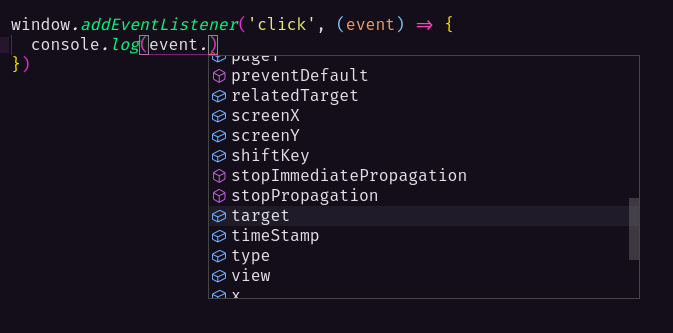

# Type Inference

A inferência de tipo permite declarar uma variável sem atribuir um tipo, no exemplo abaixo como o valor atribuido à variável é uma string, o prório TypeScript foi capaz de definir que o tipo dela é string.

```ts
let msg = 'Mensagem definida'

console.log(msg)
```

Um outro caso de como inference pode ser útil, é no autocomplete de algumas funções, por exemplo, ao criar um event listener já sabemos que a função de callback recebe o objeto `event` como argumento, e o TypeScript já entende o tipo do `event` automaticamente, logo se você utilizar este objeto, o editor exibirá uma tooltip com todas as propriedades e métodos possível para ele:


