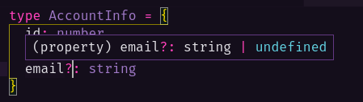

# Estendendo Type Aliases com Intersection

Nessa aula criaremos tipos que serão utilizados em um app de games, o primeiro tipo é um type alias chamado `Account` para receber contas de usuários:

```ts
type AccountInfo = {
  id: number
  name: string
  email?: string
}

const jonatas_account: AccountInfo = {
  id: 23,
  name: 'Jonatas Antunes',
  email: 'jonatas@teste.com.br'
}
```

Rapare que para fazer com que alguma propriedade, como o `email`, sejá opcional, basta inserir um ponto de interrogação (?) após o nome dela, ao passar o mouse por cima da propriedade, o TypeScript a exibirá como `string | undefined`:



Com a intersection podemos unir dois tipos em um só através da keyword (&), já temos um tipo `Account` criado para receber contas de usuários, então podemos criar um novo tipo `Char` para receber informações do seu personagem e um terceiro tipo chamado `Player` que será a união dos dois tipos:

```ts
type AccountInfo = {
  id: number
  name: string
  email?: string
}

const jonatas_account: AccountInfo = {
  id: 23,
  name: 'Jonatas Antunes',
  email: 'jonatas@teste.com.br'
}

type CharInfo = {
  nickname: string
  level: number
}

type PlayerInfo = AccountInfo & CharInfo // intersection

const jonatas_char: PlayerInfo = {
  id: 23,
  name: 'Jonatas Antunes',
  email: 'jonatas@teste.com.br',
  nickname: 'Johnny Dark',
  level: 10
}
```
