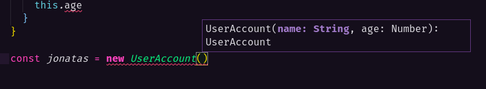
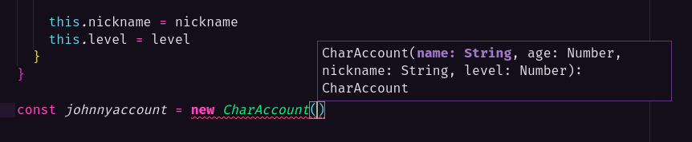
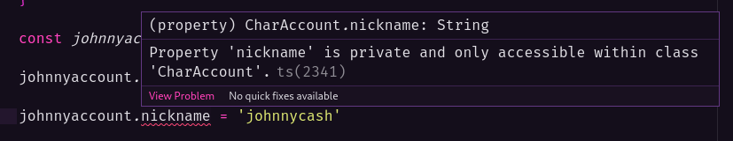
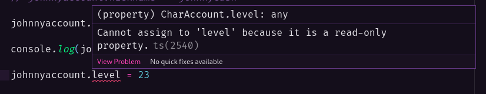
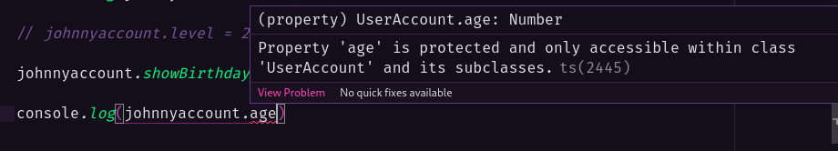
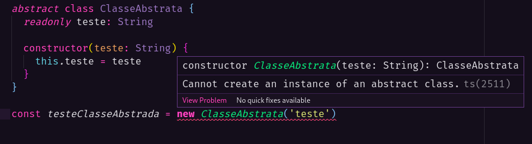

# Classes

Ao criar uma classe precisamos de um método contrutor para atribuir os valores das propriedades que os objetos instanciados poderão ter:

```ts
class UserAccount {
  name: String
  age: Number

  constructor(name: String, age: Number) {
    this.name = name
    this.age = age
  }
}
```

Como definimos as tipagens das propriedades no método construtor, o proprio TypeScript fornecerá dicas de quais propriedades o objeto pode receber ao criar uma instância:



## Métodos

Ao adicionar funções nas classes, deve-se passar o tipo de retorno, no exemplo abaixo como será apenas exibido um log, então o tipo pode ser definido como `void`:

```ts
logDetails(): void {
  console.log(`O jogador ${this.name} possui ${this.age} anos de idade.`)
}
```

```ts
jonatas.logDetails()
```

## Extend

Uma classe pode possuir propriedades de outras classe além das suas próprias propriedades, no método contrutor colocamos todos os valores, tanto os valores da própria classe, quanto os valores herdados. Para obter as propriedades da classe superior, temos que utilizar a função `super()`:

```ts
class CharAccount extends UserAccount {
  nickname: String
  level: Number

  constructor(name: String, age: Number, nickname: String, level: Number) {
    super(name, age)

    this.nickname = nickname
    this.level = level
  }
}
```

O TypeScript dará dicas de quais propriedades o objeto poderá receber, tanto as propriedades do própria classe, quanto das propriedades herdadas:



## Modifiers (Modificadores)

As propriedades que criamos podem ter seu valor modificados com alguma atribuição, porém supomos que precisamos de uma propriedade que não pode ser modificada depois de sua criação, no exemplo abaixo vamos definir que a propriedade `nickname` receberá o modificador `private`:

```ts
private nickname: String
```

Ao tentar alterar essa propriedade, o TypeScript exibirá um alerta de erro, indicando que ela só pode ser utilizada dentro do escopo da própria classe.



Existe um outro modificador chamado `readonly` que permite que a propriedade seja exibida fora da classe, porém não poderá ser alterada por atribuição e também não poderá ser modificada mesmo se estiver sendo usada em algum método dentro da própria classe:

```ts
readonly level: Number
```

Se tentar mudá-la será exibido um alerta:



> As propriedades que não recebem modifiers, ficam com um modifier implícito chamado `public`, que permite tudo, visualização e alteração.

O último modificador se chama `protected` e ele é utilizado quando queremos que uma propridade possa ser chamada dentro da classe e das classes que à extendem também, porém ela não pode ser chamada fora da classe:

```ts
class UserAccount {
  public name: String
  protected age: Number

  constructor(name: String, age: Number) {
    this.name = name
    this.age = age
  }

  logDetails(): void {
    console.log(`O jogador ${this.name} possui ${this.age} anos de idade.`)
  }
}

class CharAccount extends UserAccount {
  private nickname: String
  readonly level: Number

  constructor(name: String, age: Number, nickname: String, level: Number) {
    super(name, age)

    this.nickname = nickname
    this.level = level
  }

  showNickname(): void {
    console.log(`O nickname do user ${this.name} é ${this.nickname}`)
  }

  showBirthdayUser(): void {
    console.log(`O jogador tem ${this.age} anos de idade`)
  }
}

const johnnyaccount = new CharAccount('Jonatas', 29, 'johnnysk8', 10)

johnnyaccount.showBirthdayUser() // O jogador tem 29 anos de idade
```

Ao tentar acessar uma propriedade `protected`, o TypeScript exibirá o seguinte alerta:



## Accessors (Getters/Setters)

São métodos especiais que criamos em classes para podemos acessar ou atribuir valores referentes às propriedades de um objeto instanciado.

Para criar um Getter, utilize a keyword `get` antes do nome do método (pode-se colocar loggers ou outras utilidades nele também):

```ts
get getLevel() {
  console.log('obtendo o level!')
  return this.level
}
```

Para chamar um Getter não é necessário utilizar a sintaxe de função, chame-o como se fosse uma propriedade comum:

```ts
console.log(johnnyaccount.getLevel)
```

O Setter é um metodo que vai atribuir um valor à alguma propridade do objeto, logo, ele deve receber o argumento e o TypeScript solicitará um tipo, utilize a keyword `set` antes do nome do método e atente-se ao modificadores, uma propriedade `readonly` por exemplo não pode ser altera por um Setter:

```ts
set setName(name: String) {
  this.name = name
}
```

Para atribuir um valor com Setter não utilize a sintaxe de função, e sim de propriedade comum de objeto:

```ts
johnnyaccount.setName = 'Johnny'
```

## Abstract Class

É uma classe "abstrata" onde você não consegue criar instânciar objetos a partir dela, porém outras classes podem extender ela. São interessantes quando queremos criar modelos para outras classes porém sem permitir que algo seja criado a partir da classe abstrata.

```ts
abstract class ClasseAbstrata {
  readonly teste: String

  constructor(teste: String) {
    this.teste = teste
  }
}
```

Ao tentar instânciar um objeto de uma classe abstrata, o TypeScript exibirá esse alerta:


